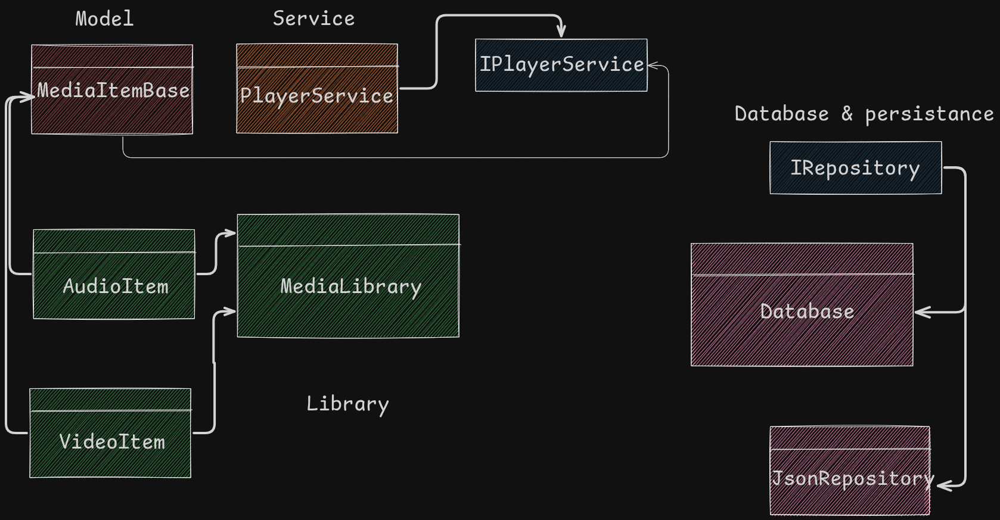

# TODO
## 10.11.25

# Create a CLI media player

# Depencies

## Spectre.Console

## FFMpeg

### FFplay

## Layout of project

### Folder Architecture
## Model
    - Models
        - MediaItemBase.cs
        - 
## Media
    - Media/Audio
    - Media/Video
## Services
    - 
## Interfaces
    - 
## Context
    - database.json
    - Database.cs
